# BuildingBobs — Product Requirements Document

**Construction Site Workforce Productivity Intelligence Platform**

> *Transforming noisy, first-person body-cam footage from construction workers into actionable productivity analytics using Multimodal Large Language Models, Vision-Language Models, and Agentic AI.*

| Field | Value |
|---|---|
| **Version** | 1.0 |
| **Date** | 2026-02-21 |
| **Status** | Draft |
| **Author** | BuildingBobs Team |

---

## 1. Executive Summary

**BuildingBobs** is an AI-powered construction workforce analytics platform that ingests **egocentric (first-person) body-cam footage** worn by construction workers and autonomously produces granular productivity reports — work completed, time allocation, action frequency, idle periods, and crew-level patterns — surfaced through an intuitive dashboard.

The input data consists of **~20-minute video clips** captured from the worker's perspective while performing tasks. These videos are characterised by **high noise, motion blur, lens distortion, and rapidly changing scenes** — making them unsuitable for traditional CV pipelines designed for static surveillance cameras. The system is built on **Multimodal LLMs (MLLMs)** and **Vision-Language LLMs (VLLMs)** that are *context-engineered* to understand **egocentric spatial interactions**: what the worker's hands are doing, what tools and materials are in view, what task is being performed, and how long each activity takes. An orchestration layer of **specialised AI agents** converts raw body-cam video into structured productivity signals without manual annotation.

### Core Value Proposition

| Stakeholder | Problem Today | BuildingBobs Solution |
|---|---|---|
| **Site Managers** | Rely on walk-throughs and daily logs — subjective, delayed | Real-time per-crew and per-task productivity dashboards |
| **Project Managers** | Cannot isolate *why* a crew is behind schedule | Root-cause analysis: idle time, rework, wait-for-material events auto-detected |
| **Safety Officers** | Review footage only after incidents | Continuous spatial-interaction monitoring flags unsafe proximity / PPE gaps |
| **Executives** | Benchmark productivity across sites manually | Cross-site analytics with normalised KPIs |

---

## 2. Problem Statement

Construction is one of the least digitised industries. Labour productivity has stagnated for decades. Site managers today have almost **zero objective, continuous visibility** into how labour hours translate into physical progress. The typical feedback loop is:

1. **Manual daily logs** — written by foremen, highly subjective.
2. **Periodic photo documentation** — static, no temporal context.
3. **Time-lapse / surveillance cameras** — provide a bird's-eye visual record but cannot capture what the worker is actually doing with their hands or tools.

> [!IMPORTANT]
> **Egocentric body-cam footage** is the richest possible signal for understanding worker activity — it shows exactly what the worker sees, touches, and manipulates. However, this footage is extremely challenging to analyse: **motion blur, rapid scene changes, lens distortion, vibration noise, and variable lighting** make traditional computer vision fragile. BuildingBobs uses MLLMs specifically because they can reason about noisy, ambiguous visual scenes in ways that rigid CV pipelines cannot.

### Key Questions the Product Must Answer

1. **What work was done today?** — e.g., "Crew A installed 14 rebar cages in Zone B."
2. **How long did each task take?** — time-on-task vs. idle / wait / travel.
3. **How many times did a worker perform a specific action?** — e.g., trips to the material laydown area.
4. **What caused delays?** — waiting for crane, missing materials, rework.
5. **How does today compare to the plan / to yesterday / to another crew?**

---

## 3. Product Vision & Goals

### Vision

> *Every construction worker wears a body camera that captures their first-person perspective. BuildingBobs transforms this egocentric footage — despite its noise, blur, and chaos — into a live productivity pulse, enabling data-driven crew management and continuous improvement.*

### Goals (v1.0)

| # | Goal | Success Metric |
|---|---|---|
| G1 | Automatically detect and classify **≥ 8 common construction activities** from egocentric footage per worker | ≥ 80 % mAP on labelled validation set |
| G2 | Produce **time-on-task breakdowns** per worker per shift from ~20-min body-cam clips | < 10 % deviation from manual audit |
| G3 | Count **action repetitions** (lifts, pours, fastening, etc.) despite motion blur and noise | ≥ 85 % accuracy vs. ground truth |
| G4 | Detect **idle / wait events** and attribute root cause from first-person visual cues | ≥ 75 % cause-attribution accuracy |
| G5 | Process a 20-min body-cam clip and deliver insights to dashboard | p95 latency < 10 min per clip |
| G6 | Support batch processing of **≥ 20 worker clips per day** per site | Verified in load testing |

---

## 4. User Personas

### 4.1 Site Superintendent — "Sam"
- **Needs**: Daily crew-level productivity summaries; alert when a crew falls below a threshold.
- **Pain**: Spends 2+ hours/day walking the site to assess progress.

### 4.2 Project Manager — "Priya"
- **Needs**: Weekly trend reports; root-cause drill-down; comparison across crews/sites.
- **Pain**: Delay reasons are anecdotal; no data to negotiate with subcontractors.

### 4.3 Safety Manager — "Carlos"
- **Needs**: Spatial interaction alerts (e.g., worker in exclusion zone, missing PPE near active crane).
- **Pain**: Reviews hours of footage only after an incident.

### 4.4 Foreman — "Mike"
- **Needs**: Quick view of his crew's productivity vs. plan on a mobile device.
- **Pain**: Paper-based daily logs are a chore and inaccurate.

---

## 5. System Architecture

### 5.1 High-Level Architecture

```mermaid
flowchart TB
    subgraph INGEST["📹 Ingestion Layer"]
        CAM["Worker Body-Cams<br/>(helmet / chest-mount)"]
        UPLOAD["End-of-Shift Upload<br/>(WiFi sync / manual)"]
        PREPROC["Video Pre-Processor<br/>(stabilisation, deblur,<br/>key-frame extraction)"]
    end

    subgraph VISION["🧠 Egocentric Vision Pipeline"]
        DET["Hand-Object Detection<br/>(fine-tuned YOLO / DETIC)"]
        HOBJ["Hand-Object Interaction<br/>(EgoHOS / 100DOH)"]
        SCENE["Scene / Environment<br/>Recognition (CLIP / SigLIP)"]
        SEG["Tool & Material<br/>Segmentation (SAM 2)"]
    end

    subgraph AGENTS["🤖 Agentic Reasoning Layer"]
        ORC["Orchestrator Agent"]
        ACT["Activity Recognition<br/>Agent"]
        SPATIAL["Egocentric Spatial<br/>Agent"]
        PROD["Productivity Scoring<br/>Agent"]
        ROOT["Root-Cause Analysis<br/>Agent"]
        NARR["Narrative / Report<br/>Agent"]
    end

    subgraph STORE["💾 Data & State"]
        VDB["Vector DB<br/>(clip embeddings)"]
        TS["Time-Series DB<br/>(TimescaleDB)"]
        PG["PostgreSQL<br/>(metadata, users)"]
        S3["Object Store<br/>(S3 / GCS — clips, frames)"]
    end

    subgraph DASH["📊 Dashboard"]
        WEB["Web App<br/>(Next.js)"]
        MOBILE["Mobile PWA"]
        ALERTS["Alert Engine<br/>(Slack, Email, SMS)"]
    end

    CAM --> UPLOAD
    UPLOAD --> PREPROC
    PREPROC --> DET
    PREPROC --> SCENE
    DET --> HOBJ
    DET --> SEG
    HOBJ --> ORC
    SCENE --> ORC
    SEG --> ORC
    ORC --> ACT
    ORC --> SPATIAL
    ACT --> PROD
    SPATIAL --> PROD
    PROD --> ROOT
    ROOT --> NARR
    ACT --> TS
    SPATIAL --> TS
    PROD --> TS
    NARR --> PG
    ORC -.-> VDB
    NARR --> WEB
    TS --> WEB
    PG --> WEB
    WEB --> ALERTS
    WEB --> MOBILE
    PREPROC --> S3
```



### 5.2 Data Flow Summary

| Stage | Input | Output |
|---|---|---|
| **Ingestion** | Raw body-cam MP4 clips (~20 min each) | Stabilised video + key-frames at 1–2 fps, stored in S3 |
| **Egocentric Vision** | Stabilised key-frames | Hand-object detections, tool/material segmentation, scene embeddings |
| **Agentic Reasoning** | Structured egocentric detections + embeddings | Activity labels, spatial events, productivity scores, root-cause narratives |
| **Storage** | Agent outputs | Time-series metrics, vector embeddings, relational metadata |
| **Dashboard** | Stored analytics | Charts, tables, alerts, natural-language summaries |

---

## 6. Agentic AI Architecture — The Multi-Agent System

The core intellectual property of BuildingBobs is its **multi-agent orchestration layer** that sits between traditional computer vision outputs and the dashboard. Each agent is a specialised invocation of an MLLM/VLLM with purpose-built context.

### 6.1 Why Agents?

A single end-to-end model cannot reliably:
- Track fine-grained spatial relationships over long temporal windows.
- Attribute productivity loss to specific root causes.
- Generate natural-language reports calibrated to different personas.

Agents enable **decomposition** — each agent solves a tractable sub-problem and passes structured outputs to downstream agents.

### 6.2 Agent Catalogue

```mermaid
graph LR
    subgraph Orchestrator
        O["🎯 Orchestrator Agent"]
    end
    subgraph Specialists
        A["🔨 Activity Recognition Agent"]
        S["📐 Spatial Interaction Agent"]
        P["📈 Productivity Scoring Agent"]
        R["🔍 Root-Cause Agent"]
        N["📝 Narrative Agent"]
    end
    O --> A
    O --> S
    A --> P
    S --> P
    P --> R
    R --> N
```



#### Agent 1 — Orchestrator Agent

| Attribute | Detail |
|---|---|
| **Role** | Route each processed scene-window to the correct specialist agents; manage shared state |
| **Model** | GPT-4o / Gemini 2.0 Flash (fast, tool-use capable) |
| **Context** | Worker ID, body-cam metadata, assigned task from schedule, clip timestamp range |
| **Tools** | `dispatch_to_agent()`, `query_vector_db()`, `get_schedule()`, `get_worker_assignment()` |

#### Agent 2 — Activity Recognition Agent

| Attribute | Detail |
|---|---|
| **Role** | Classify **what** the worker is doing in each temporal segment of the body-cam clip |
| **Model** | Gemini 2.0 Pro / GPT-4o (vision + text — long-context video capable) |
| **Input** | Sequence of stabilised key-frames with hand-object detection overlays; scene-change timestamps |
| **Context Engineering** | Few-shot exemplars of egocentric construction activities; a **Construction Activity Ontology** (hierarchy: productive → rebar tying, nailing, concrete pour …; supportive → carrying materials, measuring; non-productive → idle, walking, waiting, phone use). Exemplars show **first-person views** of each activity. |
| **Output** | `{ worker_id, activity_label, confidence, start_ts, end_ts }` |

#### Agent 3 — Spatial Interaction Agent

| Attribute | Detail |
|---|---|
| **Role** | Understand the worker's **spatial context** from their egocentric view — what they see, what tools/materials are within reach, what environment they're in |
| **Model** | Gemini 2.0 Pro (strong spatial reasoning) |
| **Input** | Key-frames with scene classification labels (CLIP); hand-object segmentation masks; detected tool/material inventory |
| **Context Engineering** | Egocentric spatial primitives (`hand_holding_tool`, `tool_in_use`, `material_visible_not_touched`, `looking_at_coworker`, `environment=indoor_formwork`); scene-to-zone mapping rules ("if you see rebar grid + sky → active_rebar_zone") |
| **Output** | `{ worker_id, inferred_zone, visible_objects[], hand_state, spatial_event (e.g. "picked_up_tool"), timestamp }` |

#### Agent 4 — Productivity Scoring Agent

| Attribute | Detail |
|---|---|
| **Role** | Aggregate activity + spatial data into **time-on-task** and **productivity KPIs** |
| **Model** | GPT-4o-mini / Claude 3.5 Sonnet (structured reasoning) |
| **Input** | Activity stream + spatial event stream for a shift window |
| **Context Engineering** | Definition of KPIs (Direct Work Rate = time doing value-adding activity / total shift time); benchmark ranges by trade and task; schedule baseline for expected output |
| **Output** | `{ crew_id, shift, direct_work_pct, indirect_work_pct, idle_pct, action_counts{}, output_estimate }` |

#### Agent 5 — Root-Cause Analysis Agent

| Attribute | Detail |
|---|---|
| **Role** | When productivity is below threshold, identify **why** |
| **Model** | GPT-4o / Claude 3.5 Opus (chain-of-thought reasoning) |
| **Input** | Productivity scores + raw spatial/activity events flagged as anomalies |
| **Context Engineering** | Causal templates adapted for egocentric view: "If idle time spikes and camera shows worker looking around / at phone → waiting; if camera shows repeated trips to material pile → material staging issue"; historical patterns from vector DB |
| **Output** | `{ worker_id, shift, root_cause_label, evidence_clips[], confidence, suggested_action }` |

#### Agent 6 — Narrative / Report Agent

| Attribute | Detail |
|---|---|
| **Role** | Generate human-readable shift summaries, daily reports, and alert messages tailored to each persona |
| **Model** | GPT-4o / Claude 3.5 Sonnet |
| **Input** | All upstream agent outputs |
| **Context Engineering** | Report templates per persona (executive summary vs. foreman daily log); tone/length calibration; embedding of relevant clips as evidence links |
| **Output** | Markdown / HTML report; push-notification text |

### 6.3 Inter-Agent Communication

Agents communicate through a **structured event bus** (e.g., Redis Streams or Kafka):

```
┌──────────────┐    JSON events     ┌──────────────┐
│  Activity    │ ──────────────────▶ │ Productivity │
│  Agent       │                     │ Agent        │
└──────────────┘                     └──────┬───────┘
                                            │
┌──────────────┐    JSON events     ┌───────▼──────┐
│  Spatial     │ ──────────────────▶ │ Root-Cause  │
│  Agent       │                     │ Agent        │
└──────────────┘                     └──────┬───────┘
                                            │
                                     ┌───────▼──────┐
                                     │ Narrative    │
                                     │ Agent        │
                                     └──────────────┘
```

Each event conforms to a **shared schema** (JSON Schema / Protobuf) ensuring agents can be independently versioned and swapped.

---

## 7. Context Engineering for Spatial Understanding

> [!NOTE]
> **Context engineering** is the deliberate design of everything the model sees — system prompts, few-shot examples, tool schemas, retrieved context, and structured data — so the MLLM can perform complex spatial reasoning it was never explicitly trained for on construction data.

### 7.1 The Egocentric Understanding Challenge

MLLMs excel at image captioning but struggle with egocentric construction footage because of:
- **Severe motion blur** — worker head/body movement causes frequent frame corruption.
- **Rapid scene changes** — looking up, down, sideways within seconds; no stable background.
- **Hand-centric reasoning** — "What tool is the worker holding? Are they using it or carrying it?"
- **Temporal activity reasoning** — "This sequence of hand motions over 30 s = rebar tying, not random movement."
- **Noisy / low-quality input** — dust, vibration, lens smudges, variable exposure.

### 7.2 Context Engineering Strategies

#### Strategy 1 — Structured Scene Representation (SSR)

Instead of asking the MLLM to reason over raw noisy pixels alone, we pre-compute a **structured egocentric scene graph** and inject it into the prompt alongside stabilised visual frames.

```json
{
  "timestamp": "2026-02-21T09:14:32Z",
  "worker_id": "W-012",
  "body_cam": "CAM-W012-helmet",
  "clip_segment": "04:32–04:47",
  "hand_state": {
    "left": { "holding": "rebar_tie_wire", "action": "twisting" },
    "right": { "holding": "pliers", "action": "gripping" }
  },
  "visible_objects": [
    { "label": "rebar_grid", "region": "center", "confidence": 0.92 },
    { "label": "concrete_form", "region": "left_bg", "confidence": 0.85 },
    { "label": "coworker", "region": "right_edge", "confidence": 0.71 }
  ],
  "environment_cues": {
    "lighting": "outdoor_overcast",
    "surface": "rebar_grid_visible",
    "inferred_zone": "active_rebar_area_B2"
  },
  "motion": {
    "camera_stability": "low (head_movement)",
    "hand_motion_pattern": "repetitive_rotational"
  }
}
```

> This gives the MLLM **hand-state, object, environmental, and motion anchors** it cannot reliably extract from noisy egocentric pixels alone.

#### Strategy 2 — Few-Shot Activity Exemplars

We provide **labelled examples** of each target activity as image + SSR + correct label triplets in the system prompt:

```
SYSTEM: You are a construction activity classifier analysing first-person body-cam footage.
Below are reference examples from similar egocentric clips:

[IMAGE: rebar_tying_egocentric.jpg]
SSR: { hands holding pliers + tie wire, repetitive rotational motion, rebar grid visible in center }
LABEL: rebar_tying

[IMAGE: idle_waiting_egocentric.jpg]
SSR: { hands at sides, no tool held, camera panning slowly (looking around), no work surface in view }
LABEL: idle_waiting

[IMAGE: carrying_materials_egocentric.jpg]
SSR: { hands gripping wooden plank, forward walking motion, scene changing rapidly }
LABEL: material_transport
...
```

#### Strategy 3 — Chain-of-Spatial-Thought (CoST) Prompting

For complex spatial queries, we prompt the model to reason step-by-step about spatial relationships before answering:

```
SYSTEM: Before classifying the activity from this body-cam clip, perform the following egocentric analysis:
1. Assess frame quality: is there motion blur, occlusion, or poor lighting? Rate usability.
2. Identify what the worker's hands are doing (holding tool, gripping material, resting, gesturing).
3. List all objects visible in the field of view and their approximate positions.
4. Describe the environment (indoor/outdoor, what structure is nearby, ground surface).
5. Analyse the motion pattern over this segment (stationary, walking, repetitive hand motion, head scanning).
6. Now classify the activity and state your confidence, accounting for frame quality.
```

#### Strategy 4 — Retrieval-Augmented Spatial Context (RASC)

We maintain a **vector database** of past scene embeddings paired with their ground-truth activity labels and spatial events. At inference time, the most similar past scenes are retrieved and injected as additional few-shot context:

```
SYSTEM: Here are the 3 most similar scenes from past analysis:
[Scene 1 — Similarity: 0.94] Label: concrete_pour, Zone: active_B2
[Scene 2 — Similarity: 0.91] Label: concrete_pour, Zone: active_B3
[Scene 3 — Similarity: 0.87] Label: formwork_removal, Zone: active_B2

Now analyse the current scene...
```

#### Strategy 5 — Tool-Augmented Spatial Queries

Agents have access to **tools** that perform deterministic spatial computations the LLM should not hallucinate:

| Tool | Purpose |
|---|---|
| `assess_frame_quality(frame)` | Returns blur score, brightness, usability rating |
| `detect_hands_and_objects(frame)` | Returns hand bounding boxes, held objects, confidence |
| `classify_scene(frame)` | Returns environment type (indoor, outdoor, near-equipment) via CLIP |
| `compute_motion_pattern(frame_sequence, window_s)` | Returns motion type (stationary, walking, repetitive, erratic) |
| `count_action_repetitions(clip, action_type)` | Counts repeated hand/tool motions in a segment |
| `get_worker_schedule(worker_id, timestamp)` | Returns the expected task for this worker at this time |

By offloading **precise spatial math** to deterministic tools and reserving the MLLM for **interpretation and reasoning**, we dramatically reduce hallucination.

---

## 8. Technology Stack

### 8.1 Core Components

| Layer | Technology | Rationale |
|---|---|---|
| **Video Pre-Processing** | |
|  Stabilisation | `vidstab` / `gyroflow` / DeepStab (CNN) | Egocentric footage has extreme camera shake; stabilisation is the critical first step |
|  Deblurring | DeblurGAN-v2 / NAFNet | Recover sharp frames from motion-blurred body-cam clips |
|  Key-Frame Extraction | PySceneDetect + uniform sampling at 1–2 fps | Detect scene changes (head turns) and sample representative frames |
|  Super-Resolution (optional) | Real-ESRGAN | Upscale low-res body-cam frames for better MLLM inference |
| **Egocentric Vision** | |
|  Hand-Object Detection | Fine-tuned YOLOv9 / DETIC (open-vocab) | Detect hands, tools, and materials in egocentric view; DETIC enables zero-shot detection of novel construction objects |
|  Hand-Object Interaction | EgoHOS / 100DOH / Hand Object Detector | Classify hand state: free, holding-object, using-tool; critical for activity segmentation |
|  Scene / Environment Recog. | CLIP ViT-L / SigLIP | Embed each frame for scene classification (indoor, outdoor, near-crane, at-laydown) without fine-tuning |
|  Tool & Material Segmentation | SAM 2 (prompted by YOLO detections) | Pixel-level masks for tools and materials in hand |
|  Egocentric Activity Recog. | EgoVLP / LaViLa / InternVideo2 | Pre-trained egocentric video-language models as feature backbone; fine-tune on construction domain |
| **Multimodal LLM** | Gemini 2.0 Pro (video-native), GPT-4o, Claude 3.5 | Reasoning over stabilised clip segments + SSR; activity classification, spatial reasoning, report generation |
| **Agent Orchestration** | LangGraph / custom Python framework | Multi-agent workflow with tool-use and shared state |
| **Vector Database** | Qdrant / Weaviate | RASC — retrieve similar past egocentric clips for few-shot context |
| **Time-Series DB** | TimescaleDB | Store and query per-worker productivity metrics over time |
| **Relational DB** | PostgreSQL | Users, projects, workers, schedules |
| **Object Storage** | AWS S3 / GCS | Raw clips, stabilised clips, key-frames, model artifacts |
| **Message Bus** | Redis Streams | Inter-agent event communication |
| **API Layer** | FastAPI (Python) | REST + WebSocket APIs for the dashboard |
| **Dashboard Frontend** | Next.js 14 + Recharts + Shadcn/UI | Responsive, real-time web dashboard |
| **Mobile** | PWA (Progressive Web App) | Foreman mobile access |
| **Auth** | Clerk / Auth0 | Role-based access |
| **Infra / Deploy** | Docker + Kubernetes (EKS/GKE) | Scalable deployment |
| **Monitoring** | Prometheus + Grafana, Sentry | System health, model drift detection |

### 8.2 Model Fine-Tuning & Training Stack

| Component | Tool |
|---|---|
| Labelling | Label Studio, CVAT (with egocentric video annotation workflows) |
| Egocentric Datasets | Ego4D, Ego-Exo4D, EPIC-Kitchens (for transfer learning pre-training) |
| Training | PyTorch + Ultralytics (YOLO), HuggingFace Transformers, MMAction2 |
| Experiment Tracking | Weights & Biases / MLflow |
| Model Registry | MLflow Model Registry |
| Serving | NVIDIA Triton Inference Server / vLLM |

---

## 9. Build Stages — Phased Roadmap

### Phase 0 — Foundation & Data Collection (Weeks 1–4)

> **Theme**: *Collect body-cam footage, set up infrastructure, establish annotation workflow.*

| # | Task | Deliverable |
|---|---|---|
| 0.1 | **Body-cam hardware selection** — evaluate helmet-mount vs. chest-mount vs. hardhat-clip cameras (GoPro, Insta360 Go, custom) for FOV, stabilisation, battery, weight | Hardware recommendation doc |
| 0.2 | **Dataset collection** — partner with 2 construction sites; equip 5–10 workers per site with body-cams; collect ~20-min clips across multiple trades/tasks | ≥ 60 hours of raw egocentric footage |
| 0.3 | Set up infrastructure — K8s cluster, S3, PostgreSQL, TimescaleDB | Terraform / Pulumi IaC scripts |
| 0.4 | Build ingestion pipeline — upload portal for body-cam MP4 files → S3 with metadata (worker ID, date, shift, assigned task) | Working upload + metadata pipeline |
| 0.5 | Set up Label Studio / CVAT for **egocentric video annotation** — temporal activity segmentation, hand-object labelling | Annotation guidelines + first 10 hours labelled |

---

### Phase 1 — Video Pre-Processing Pipeline (Weeks 5–8)

> **Theme**: *Tame the noisy body-cam footage into model-ready input.*

> [!WARNING]
> This phase is **critical and non-negotiable** for egocentric footage. Without stabilisation and deblurring, downstream models and MLLMs will fail on the majority of frames.

| # | Task | Deliverable |
|---|---|---|
| 1.1 | **Video stabilisation pipeline** — integrate `vidstab` (FFmpeg) for real-time stabilisation; evaluate DeepStab CNN for severe cases | Stabilised clips with < 50 % residual shake vs. raw |
| 1.2 | **Motion deblurring** — deploy DeblurGAN-v2 / NAFNet; benchmark PSNR improvement on construction body-cam frames | ≥ 3 dB PSNR improvement on blurred frames |
| 1.3 | **Key-frame extraction** — combine PySceneDetect (for scene-change boundaries like head turns) + uniform sampling at 1–2 fps | Key-frames stored in S3 with timestamps |
| 1.4 | **Frame quality scorer** — build a lightweight CNN or use Laplacian variance to score each frame for blur/lighting | Quality scores per frame; auto-discard unusable frames |
| 1.5 | **Optional: super-resolution** — evaluate Real-ESRGAN for low-res body-cam upscaling | A/B accuracy test with and without SR |

---

### Phase 2 — Egocentric Vision + Agentic Reasoning Layer (Weeks 7–16)

> **Theme**: *Build the hand-object detection models, egocentric scene understanding, and the multi-agent system that turns body-cam footage into productivity insights.*

> [!IMPORTANT]
> Phase 2 is the **core IP** of BuildingBobs. It runs partially in parallel with Phase 1 (agent schema design starts in Week 7 while pre-processing is stabilising). This phase has 3 sub-tracks: **Egocentric Vision Models**, **Agent Development**, and **Integration**.

#### Sub-Track A — Egocentric Vision Models (Weeks 7–12)

| # | Task | Detail | Deliverable |
|---|---|---|---|
| 2A.1 | **Hand-Object Detection** | Fine-tune YOLOv9 on construction egocentric data: classes = `left_hand`, `right_hand`, `hammer`, `drill`, `pliers`, `rebar`, `nail_gun`, `measuring_tape`, `concrete_bucket`, `lumber`, `wire`, `safety_glasses`, etc. Use DETIC for zero-shot fallback on unseen objects. | mAP ≥ 0.70 on egocentric val set |
| 2A.2 | **Hand-Object Interaction (HOI)** | Deploy EgoHOS or 100DOH model to classify hand state: `free`, `holding_tool`, `holding_material`, `using_tool`, `two_hand_grip`. Fine-tune on labelled construction clips. | Hand-state accuracy ≥ 80 % |
| 2A.3 | **Scene / Environment Recognition** | Use CLIP ViT-L / SigLIP to embed each key-frame. Build a scene classifier on top: `rebar_area`, `formwork`, `concrete_pour`, `staging`, `break_area`, `indoor_finishing`, `rooftop`, `excavation`, etc. | Scene classification accuracy ≥ 75 % |
| 2A.4 | **Tool & Material Segmentation** | Use SAM 2 prompted by YOLO detections to get pixel-level masks for tools and materials in hand. Enables precise hand-object interaction analysis. | IoU ≥ 0.65 on construction tool masks |
| 2A.5 | **Egocentric Activity Feature Backbone** | Fine-tune EgoVLP or LaViLa on construction egocentric clips for temporal activity feature extraction. Use Ego4D / EPIC-Kitchens for pre-training, then domain-adapt on our labelled construction data. | Feature embeddings that cluster visually similar activities |
| 2A.6 | **Build the Egocentric SSR Generator** | Combine outputs of 2A.1–2A.5 into a per-frame-batch JSON SSR (hand state, visible objects, scene, motion pattern, quality score). This is the **primary input to all agents**. | JSON SSR generator producing structured output per 15 s window |

#### Sub-Track B — Agent Development (Weeks 9–14)

| # | Task | Detail | Deliverable |
|---|---|---|---|
| 2B.1 | **Agent Schema Design** | Define input/output JSON schemas for each agent. Define tool interfaces. Define the Construction Activity Ontology (3-level hierarchy: category → activity → sub-action). | Schema spec document + ontology YAML |
| 2B.2 | **Activity Recognition Agent** | Build with CoST prompting + few-shot egocentric exemplars. Input: sequence of SSRs + stabilised key-frames for a 2–5 min window. The agent reasons about hand motions + visible objects + environment to classify activity. Implement confidence thresholds and "uncertain" fallback. | ≥ 80 % accuracy on 8–10 activity classes |
| 2B.3 | **Egocentric Spatial Agent** | Build with SSR + tool-augmented queries. Reasons about what the worker sees, what zone they're likely in (from environmental cues), what tools/materials are available, and whether the spatial context matches the assigned task. | Scene-to-zone mapping accuracy ≥ 85 % |
| 2B.4 | **Productivity Scoring Agent** | Aggregates activity stream + spatial stream for a full clip (∼20 min). Computes: `direct_work_pct`, `supportive_work_pct`, `idle_pct`, `action_counts`, `estimated_output`. Uses schedule baseline from `get_worker_schedule()` tool. | Scores validated ± 10 % vs. manual audit |
| 2B.5 | **Root-Cause Analysis Agent** | When `idle_pct` exceeds threshold or `direct_work_pct` is below expected, analyses the raw SSR event stream to identify why. Uses causal templates + RASC retrieval of similar past patterns. | Plausible root-causes for ≥ 75 % of flagged clips |
| 2B.6 | **Narrative / Report Agent** | Generates per-worker shift summaries and per-crew daily roll-ups. Persona-tuned templates (foreman gets brief stats; PM gets trend analysis). Includes links to evidence clip segments. | Readable daily reports per worker and per crew |

#### Sub-Track C — Integration (Weeks 13–16)

| # | Task | Detail | Deliverable |
|---|---|---|---|
| 2C.1 | **Orchestrator Agent** | Build the master agent that takes a raw clip + worker metadata, triggers pre-processing, generates SSRs, dispatches to Activity + Spatial agents, then chains to Productivity → Root-Cause → Narrative. Implemented in LangGraph with parallel execution where possible. | End-to-end pipeline: MP4 → dashboard-ready JSON + report |
| 2C.2 | **RASC Vector Pipeline** | Index all processed SSR embeddings + labels into Qdrant. At inference, retrieve top-3 most similar past clips and inject as few-shot context. | Retrieval latency < 200 ms; improves classification by ≥ 5 % |
| 2C.3 | **Confidence & Human-in-the-Loop** | When any agent returns confidence < threshold, flag the clip segment for human review in Label Studio. Human corrections feed back into the RASC vector DB and fine-tuning dataset. | HITL review queue with < 24 h turnaround |
| 2C.4 | **End-to-End Benchmark** | Process 20 test clips (covering all 8+ activity classes) end-to-end. Measure: activity accuracy, time-on-task deviation, action count accuracy, processing latency. | Benchmark report meeting Phase 2 exit criteria |

#### Phase 2 Exit Criteria

| Metric | Target |
|---|---|
| Activity classification accuracy (8+ classes) | ≥ 80 % |
| Time-on-task deviation from manual audit | < 10 % |
| Action count accuracy | ≥ 85 % |
| Root-cause attribution (when productivity is below threshold) | ≥ 75 % plausible |
| End-to-end processing latency (20-min clip → results) | < 10 min |
| SSR generation reliability | ≥ 95 % of frames produce valid SSR |

---

### Phase 3 — Dashboard & API (Weeks 12–18)

> **Theme**: *Make insights accessible and actionable.*

| # | Task | Deliverable |
|---|---|---|
| 3.1 | Design dashboard wireframes (Figma) | Approved designs for 5 key views |
| 3.2 | Build FastAPI backend — REST + WebSocket | API docs (OpenAPI / Swagger) |
| 3.3 | Build **Shift Summary View** — per-crew time-on-task pie chart, action counts | Functional UI |
| 3.4 | Build **Trend View** — productivity over days/weeks with drill-down | Functional UI |
| 3.5 | Build **Live View** — near-real-time annotated camera feed with activity labels | Functional UI |
| 3.6 | Build **Root-Cause View** — flagged events with evidence clips | Functional UI |
| 3.7 | Build **Report View** — generated daily/weekly reports (PDF export) | Functional UI |
| 3.8 | Implement role-based access control | Separate views for each persona |
| 3.9 | Build alert engine — Slack, Email, SMS notifications | Configurable alert rules |

---

### Phase 4 — Integration & Hardening (Weeks 16–22)

> **Theme**: *Deploy on a live site and iterate.*

| # | Task | Deliverable |
|---|---|---|
| 4.1 | Deploy on partner construction site (10 workers with body-cams) | System running in production |
| 4.2 | A/B test agent accuracy vs. manual logs | Accuracy report |
| 4.3 | Tune model thresholds and agent prompts based on real-world body-cam footage | Improved accuracy |
| 4.4 | Add model-drift monitoring (Prometheus + custom metrics) | Alerts for accuracy degradation |
| 4.5 | Performance optimisation — batch processing, caching, inference cost reduction | Reduced cost per camera-hour |
| 4.6 | Security audit — data encryption, access logs, GDPR/privacy review | Security report |

---

### Phase 5 — Scale & Extend (Weeks 20–30)

> **Theme**: *Multi-site, multi-trade, advanced analytics.*

| # | Task | Deliverable |
|---|---|---|
| 5.1 | Multi-site deployment (5+ sites) | Onboarding playbook |
| 5.2 | Add trade-specific activity models (electrical, plumbing, HVAC) | Extended activity ontology |
| 5.3 | Cross-site benchmarking dashboard | Normalised KPI comparison |
| 5.4 | Predictive analytics — schedule delay prediction based on productivity trends | Forecast UI |
| 5.5 | Integration with PM tools (Procore, P6, MS Project) | API connectors |
| 5.6 | Mobile PWA for foremen | Deployed and tested |

---

## 10. Dashboard — Key Views

### 10.1 Shift Productivity Summary

| Element | Description |
|---|---|
| **Time-on-Task Donut** | Productive / Supportive / Idle breakdown per crew |
| **Action Count Table** | Number of rebar ties, pours, lifts, trips to laydown |
| **Timeline Strip** | Horizontal bar showing activity stream colour-coded by label |
| **Camera Quick-View** | Thumbnail of annotated key-frame at any selected moment |

### 10.2 Trend Analysis

| Element | Description |
|---|---|
| **Line Chart** | Direct Work Rate % over past 14 days per crew |
| **Heatmap** | Activity mix by hour (shows peak productive hours) |
| **Comparison Table** | Crew A vs. Crew B vs. Planned |

### 10.3 Root-Cause Explorer

| Element | Description |
|---|---|
| **Flagged Events List** | Sorted by impact on productivity |
| **Evidence Panel** | Clip playback + SSR overlay for each event |
| **Suggested Actions** | AI-generated recommendations |

### 10.4 AI-Generated Reports

| Element | Description |
|---|---|
| **Daily Summary** | Natural-language paragraph + key stats per crew |
| **Weekly Roll-Up** | Trends, top root-causes, recommendations |
| **Export** | PDF / CSV / email distribution |

---

## 11. Privacy, Ethics & Compliance

> [!CAUTION]
> Body-cam footage is **the worker's own perspective** — it captures what they see and touch. While it does not directly identify the wearer, it may capture **co-workers' faces and conversations**. Privacy-by-design is non-negotiable.

| Concern | Mitigation |
|---|---|
| **Worker identification** | Analysis uses **anonymised worker IDs** (mapped from body-cam assignment). Faces of co-workers captured in footage are blurred in any stored/displayed frames. |
| **Consent** | **Individual consent** from each worker wearing a body-cam. Site-level consent from all workers who may appear in others' footage. Compliant with GDPR Article 6(1)(f) — legitimate interest with safeguards. |
| **Data retention** | Raw clips deleted after 30 days; only aggregated metrics retained long-term. |
| **Bias** | Activity classifiers tested for bias across PPE types, clothing, and environmental conditions. |
| **Worker misuse prevention** | System reports **crew-level** not **individual-level** productivity by default. Individual drill-down requires explicit management justification and is audit-logged. |
| **Audio** | Body-cams should record **video only** (no audio) to avoid conversation surveillance concerns. |
| **Regulatory** | Comply with local labour surveillance and wearable monitoring laws. Legal review required per deployment region. |

---

## 12. Key Risks & Mitigations

| Risk | Impact | Likelihood | Mitigation |
|---|---|---|---|
| MLLM hallucination in activity labels | Wrong productivity data → bad decisions | Medium | Tool-augmented queries; confidence thresholds; human-in-the-loop review for low-confidence segments |
| **Severe motion blur / unusable frames** | Missing detections → gaps in data | **High** | Multi-stage pre-processing (stabilise → deblur → quality score); discard low-quality frames and interpolate; prompt MLLM with quality context |
| **Camera dislodgement / occlusion** | Worker adjusts helmet; camera blocked by hand | **High** | Detect camera-blocked events automatically (black/blurred frames > 10 s); exclude from analysis; report gaps |
| Worker resistance / union pushback | Delayed adoption | Medium | Worker-level data anonymised in crew reports; transparent data policy; involve workers in design |
| API cost for MLLM inference at scale | High operating cost | Medium | Use lightweight models for classification; reserve expensive models for root-cause/narration; batch processing; RASC reduces per-call context |
| Model drift over time / new trades | Accuracy degrades | Medium | Continuous eval pipeline; automated retraining trigger; human-labelled correction loop |
| **Body-cam battery / storage limits** | Incomplete shift coverage | Medium | Recommend cameras with ≥ 4 h battery; chunk uploads during breaks; prioritise key task windows |

---

## 13. Success Metrics & KPIs

| Metric | Target (v1.0) | Measurement |
|---|---|---|
| Activity classification accuracy | ≥ 80 % mAP | Weekly eval on held-out labelled data |
| Time-on-task deviation from audit | < 10 % | Monthly manual audit comparison |
| Action count accuracy | ≥ 85 % | Spot-check against manual tally |
| Dashboard load time (p95) | < 3 s | Synthetics monitoring |
| Insights latency (footage → dashboard) | < 15 min | End-to-end pipeline timing |
| User adoption (daily active managers) | ≥ 70 % of site managers | Product analytics |
| Net Promoter Score | ≥ 40 | Quarterly survey |
| Productivity improvement on pilot sites | ≥ 10 % Direct Work Rate increase within 3 months | Before/after measurement |

---

## 14. Open Questions for Stakeholder Input

| # | Question |
|---|---|
| 1 | What **body-cam hardware** do partner sites prefer? (helmet-mount, chest-mount, hardhat-clip) |
| 2 | What is the target **number of activity classes** for v1? (Proposed: 8–12 across 2 trades.) |
| 3 | Should the system support **individual worker dashboards** or strictly **crew-level** only in v1? |
| 4 | What **PM tools** (Procore, P6, etc.) should we prioritise for schedule integration? |
| 5 | What is the acceptable **cost per clip-hour** for cloud inference? (Estimated: $0.50–$2.00 per 20-min clip) |
| 6 | Is there a preference for **on-premise vs. cloud** deployment for data sovereignty reasons? |
| 7 | How will body-cams be **charged and synced** between shifts? (Infrastructure needed on-site) |

---

## 15. Glossary

| Term | Definition |
|---|---|
| **MLLM** | Multimodal Large Language Model — an LLM that accepts both text and image/video inputs |
| **VLLM** | Vision-Language Large Model — a model specifically designed for joint vision-language tasks |
| **Egocentric Video** | First-person footage captured from a camera worn by the worker (helmet or chest mount) |
| **SSR** | Structured Scene Representation — a JSON encoding of hand state, visible objects, environment cues, and motion patterns extracted from egocentric frames |
| **CoST** | Chain-of-Spatial-Thought — a prompting technique that forces step-by-step egocentric spatial reasoning |
| **RASC** | Retrieval-Augmented Spatial Context — using vector similarity search to provide similar past clips as context |
| **HOI** | Hand-Object Interaction — detection of what the worker's hands are doing relative to tools and materials |
| **EgoHOS / 100DOH** | Egocentric hand-object segmentation / 100 Days of Hands — models for detecting hand state in first-person video |
| **DETIC** | Open-vocabulary object detector that can detect novel object classes without fine-tuning |
| **Direct Work Rate** | Percentage of shift time spent on value-adding activities |
| **Agent** | A specialised MLLM invocation with defined role, context, tools, and output schema |

---

*End of PRD v1.0*
